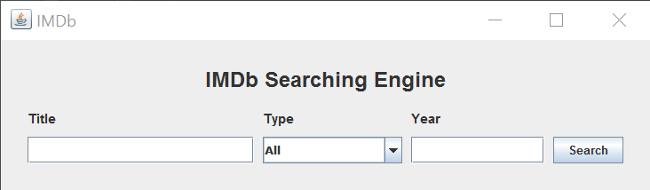
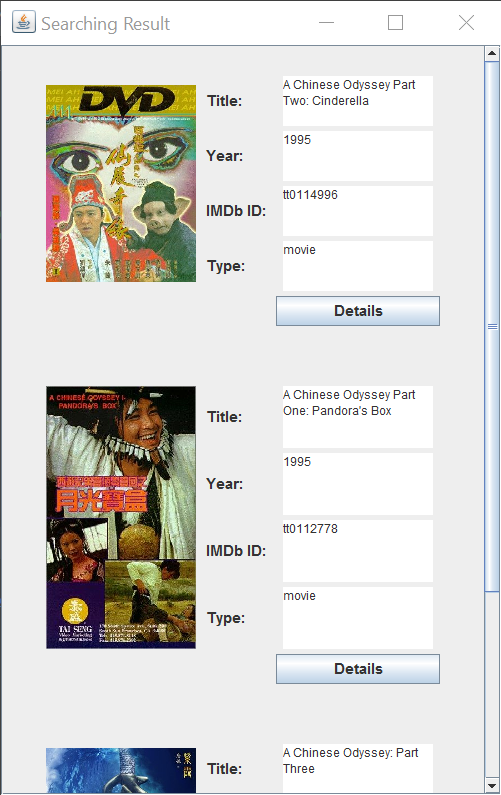
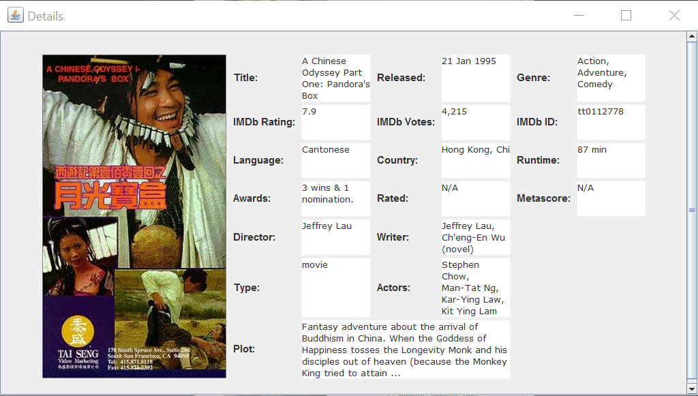
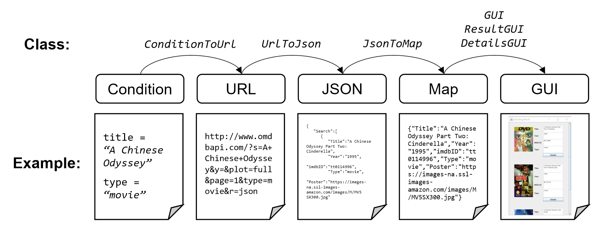

# IMDb-Searching-Engine

An IMDb Searching Engine based on Java and OMDb API.

## Attention

* Before running the project, please make sure that `json.jar` is already added to Classpath. If not, you can add `json-20160810.jar` in this repository.
* This project is developed with:

> IntelliJ IDEA 2016.2.5
> Build #IC-162.2228.15, built on October 14, 2016
> JRE: 1.8.0_112-release-287-b2 x86
> JVM: OpenJDK Server VM by JetBrains s.r.o

## What is this project?

This is a Java searching engine which can search movie and its information. The data of movies is from [OMDb API](http://www.omdbapi.com/).

## Screenshots

<table>
    <tr>
        <td>
            
        </td>
        <td>
            
        </td>
        <td>
            
        </td>
    </tr>
</table>

## How this project works?

This searching engine can be regarded as a GUI of [OMDb database](http://www.omdbapi.com/). You can enter their conditions (shown as the left screenshot), then choose one exact result (shown as the middle screenshot) and check its details (shown as the right screenshot).

For example, if you want to search movie *[A Chinese Odyssey Part One: Pandora's Box](https://en.wikipedia.org/wiki/A_Chinese_Odyssey)*, just enter name condition `A Chinese Odyssey` (type condition `Movie` is optional). The searching procedure is as following:

<table>
    <tr>
        <td>
            
        </td>
    </tr>
</table>

When choosing one result to check its details, the searching engine will search again using IMDb ID as new searching condition.

## Contact me

gaofangshu@foxmail.com
